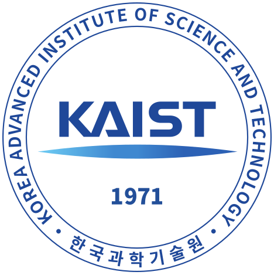

# Ábel Ilyés-Kun

  

## About Me

**Born**: 26 September 1999  
📞 00491726448760  
✉️ ikunabel@gmail.com
🇩🇪 Aachen, Germany

## Languages

- **German** (native)  
- **Hungarian** (native)  
- **English** (advanced)  
- **French** (intermediate)  
- **Romanian** (elementary)

## Societies

- **OB Member of 창작동화 Jazz Band** (2024–)  
- **Rowing Club Bad Ems** (2016–2019)

## Interests

- Computer Music  
- Natural Language Processing  
- Jazz Piano  
- Video and Music Editing  
- Running, Table Tennis, Football  
- Psychology

> I am Ábel, a computer science graduate from RWTH Aachen University.  
> My academic interests include AI for music generation, natural language processing, and computational neuroscience.  
> Beyond my studies, I am passionate about playing the piano and enjoy transcribing recordings from my favorite musicians, Brad Mehldau and Chick Corea.

# Research and Projects

### 🎹 Generating MIDI Piano Performance with Transformers  
*Summer 2025*  
As part of a university lab project under the Computer Vision Chair, I am currently working on generating MIDI piano performances conditioned on MIDI input. We use REMI tokenization and train  Mistral models on the MAESTRO dataset. Our focus now lies in benchmarking our results against a recent SOTA Transformer-based MIDI generation model called Moonbeam. The project involves hands-on experimentation with model architectures, tokenizers, embedding functions and evaluation metrics.

### 🐍 Mamba State-space Model  
*Summer 2024*  
Over the past summer at my home university, I participated in a research seminar involving Mamba, a state-of-the-art alternative to Transformers. This project was supervised by Professor Hector Geffner at the Machine Learning and Reasoning chair. The experience sparked my interest in continuing to explore state-space models on music data! Since Mamba-variants can process extremely long sequences more efficiently than Transformers, it could be interesting to see how they handle long temporal dependencies in music data.

### 🎵 Computer-generated Music  
During my bachelor degree at RWTH Aachen University, I did a seminar on computer-generated music, where I covered recent neural-network-based approaches like Google Magenta or the Bachbot, also discussing the LZ compression algorithm within the OpenMusic software. Ever since then, I have been following new research papers on computer-generated music.

### 🧠 Thesis at Institute for Computational and Systems Neuroscience  
*October 2022 – May 2023*  
I gained experience on hyper-parameter optimization during my bachelor’s thesis at the research institute in Jülich: The goal here was to find out whether an optimizee from the computational neuroscience domain can be embedded into Optuna, a framework originally designed for optimizing the hyper-parameters of machine learning models. This work involved extensive parallel computations on the JURECA supercomputer. The conclusion was that, out of many existing search algorithms like random sampling, evolutionary algorithms and Bayesian approaches, a version of the tree-structured parzen estimator worked best for this purpose.

### 🚙 Practical at Cyber-Physical Mobility Lab  
*October 2021 – February 2022*  
Implemented trajectory planning and collision avoidance for model vehicles. Organized workflow in team of six with Scrum and Git.

# Work Experience

### Tutor at Research Group for Programming Languages and Verification  
*October 2021 – March 2022, October 2022 – March 2023*  
Gave weekly classes to group of students (~15) in lecture hall, evaluated coding assignments and exams and helped with questions. Tutored students in Software Development (Java), Functional Programming (Haskell), Logic Programming (Prolog) and Verification.

### Internship at BWI GmbH  
*March 2020*  
Received an overview on project management and project organization (Scrum). Was introduced to current JIRA-projects at the company.

# Education

  

 

**KAIST MSc** Computer Science Exchange, AI Track  
*September 2024 – December 2024*  
Received DUO-Korea Scholarship

---

  

 
**RWTH Aachen University** MSc Computer Science, AI Track  
*October 2023 – Present*

---

  

**RWTH Aachen University** BSc Computer Science  
*October 2019 – June 2023*  
- Thesis at Forschungszentrum Jülich (national research institution) on hyperparameter optimization
- Projects on neuro-inspired computing, microcontroller programming and automated control of model vehicles

---

**Goethe Gymnasium Bad Ems** A levels (Abitur)  
- GPA: 1.6  
- Majors: English, Mathematics, Physics  
- Graduate prize for Physics (DPG-Abiturpreis)

# Programming Stack

**Languages & Tools**  
Python, C++, Java, C#, SQL, Bash, Git, Linux, Slurm

**Machine Learning & Deep Learning**  
PyTorch, NumPy, pandas, Matplotlib, Optuna, Jupyter

